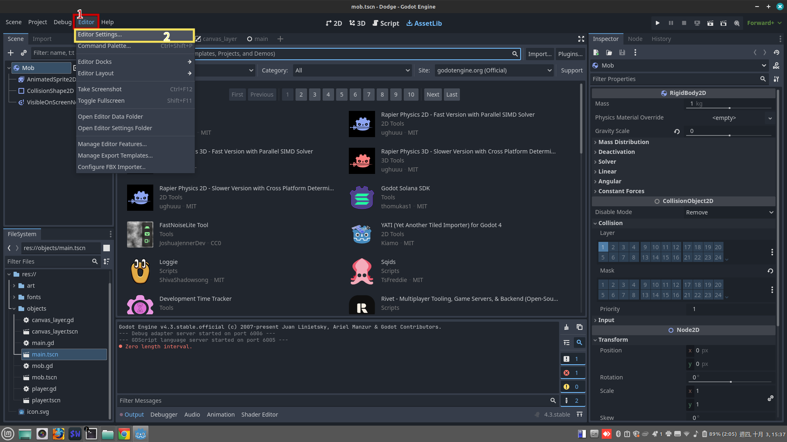
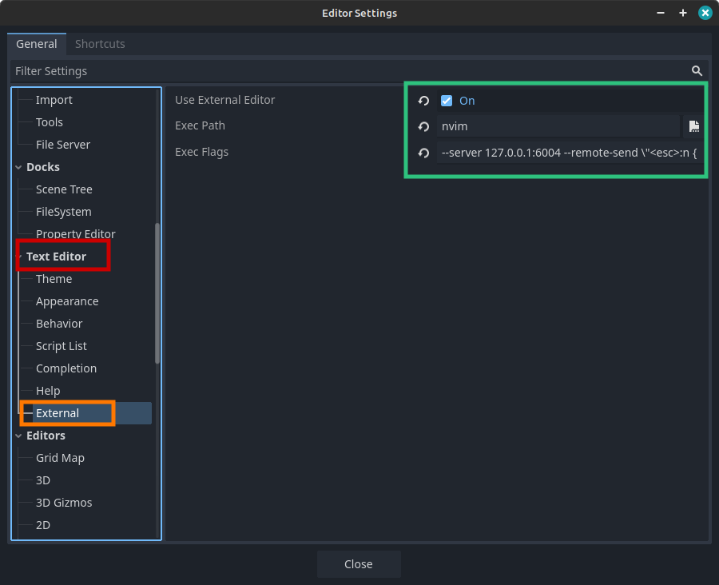

# Install Tutorial

<!--toc:start-->
- [Install Tutorial](#install-tutorial)
  - [For linux](#for-linux)
    - [Python environment](#python-environment)
      - [Install pyenv](#install-pyenv)
      - [Install poetry](#install-poetry)
    - [Run `init.py`](#run-initpy)
  - [For windows](#for-windows)
    - [Install git](#install-git)
    - [Python environment](#python-environment)
      - [Install pyenv](#install-pyenv)
      - [Install poetry](#install-poetry)
    - [Install scoop](#install-scoop)
    - [Install Visual Studio](#install-visual-studio)
    - [Run `init.py`](#run-initpy)
  - [Setup godot](#setup-godot)
<!--toc:end-->

This document can show how to use this repo to setup for neovim.

## For linux
You should run these commands to install necessary tools.
```bash
sudo apt-get update
sudo apt-get install -y git build-essential
```

You need install neovim `0.10.0+` first. You can clone [neovim](https://github.com/neovim/neovim), and then build by yourself.

### Python environment
This repo uses `pyenv` to manage python verisons and `poetry` to manage the virtual environment.

#### Install pyenv
First, please run these commands to install necessary packages for `pyenv`.
```bash
sudo apt-get update

sudo apt-get install build-essential libssl-dev zlib1g-dev \
    libbz2-dev libreadline-dev libsqlite3-dev curl git \
    libncursesw5-dev xz-utils tk-dev libxml2-dev libxmlsec1-dev libffi-dev liblzma-dev
```
Please clone `pyenv` into `$HOME/.pyenv`.
```bash
git clone https://github.com/pyenv/pyenv.git ~/.pyenv
```

And then you should add the lines into `~/.bashrc`:
```bash
export PYENV_ROOT="$HOME/.pyenv"
command -v pyenv > /dev/null || export PATH="$PYENV_ROOT/bin:$PATH"
eval "$(pyenv init -)"
```

Please use `pyenv` to install a python as the global python.
```bash
pyenv install 3.10.12
pyenv global 3.10.12
```

#### Install poetry
Please run this command to install `poetry`.
```bash
curl -sSL https://install.python-poetry.org | python3 -
```

Please add this line into `~/.bashrc`:
```bash
export PATH=$PATH:$HOME/.local/bin/
```

We need change the setting of `poetry` to create `.venv` for each python project, so we should run this command.
```bash
poetry config virtualenvs.in-project true
```

### Run `install.py`
This repo offers the python file `install.py`. It can install all necessary packages, and then copy all setting files to suitable location. You just run this command.
```bash
python3 install.py
```

If you don't get any error message, you succeed to setup the neovim.


## For windows
### Install git
Please get the installer from [this web](https://git-scm.com/) for `git` on windows.

### Python environment
#### Install pyenv
`pyenv` cannot support windows, but we can use [pyenv-win(https://github.com/pyenv-win/pyenv-win.git) to manage python verisons.

You can run this command to get `pyenv-win` on `powershell`.
```bash
git clone https://github.com/pyenv-win/pyenv-win.git "%USERPROFILE%\.pyenv"
```

Or, you can use this command to get `pyenv-win` on `bash` of `msys2`.
```bash
git clone https://github.com/pyenv/pyenv.git ~/.pyenv
```

And then please run the commands on `powershell` to set the environment variables `PYENV`, `PYENV_ROOT` and `PYENV_HOME`.
```bash
[System.Environment]::SetEnvironmentVariable('PYENV',$env:USERPROFILE + "\.pyenv\pyenv-win\","User")

[System.Environment]::SetEnvironmentVariable('PYENV_ROOT',$env:USERPROFILE + "\.pyenv\pyenv-win\","User")

[System.Environment]::SetEnvironmentVariable('PYENV_HOME',$env:USERPROFILE + "\.pyenv\pyenv-win\","User")
```

Finally, please run this command to sset the environment variable `User PATH`.
```bash
[System.Environment]::SetEnvironmentVariable('path', $env:USERPROFILE + "\.pyenv\pyenv-win\bin;" + $env:USERPROFILE + "\.pyenv\pyenv-win\shims;" + [System.Environment]::GetEnvironmentVariable('path', "User"),"User")
```

Please use `pyenv-win` to install python.
```bash
pyenv install 3.10.11
```

And then set the global python.
```bash
pyenv global 3.10.11
```

#### Install poetry
Please run this command on `powershell` with the supervisor right in order to install `poetry`.
```bash
(Invoke-WebRequest -Uri https://install.python-poetry.org -UseBasicParsing).Content | python -
```

And then you need use this command to add `poetry` add the environment variable `User PATH`.
```bash
[System.Environment]::SetEnvironmentVariable('path', $env:USERPROFILE + "\AppData\Roaming\Python\Scripts" + [System.Environment]::GetEnvironmentVariable('path', "User"), "User")
```

We need change the setting of `poetry` to create `.venv` for each python project, so we should run this command.
```bash
poetry config virtualenvs.in-project true
```
### Install scoop
`Scoop` is a package manager for windows. We need use `scoop` to install all necessary packages for neovim.

Please use this command on powershell to install `scoop`.
```bash
iwr -useb get.scoop.sh | iex
```

### Install Visual Studio
In order to find standard library for `clangd`, we need install `Visual Studio`. You can download the installer from [this web](https://visualstudio.microsoft.com/zh-hant/vs/).

### Run `init.py`
Please run this command to use the python file `init.py` to set the configuration for neovim.
```bash
python init.py
```

## Setup godot
Please download [godot 4.x](https://godotengine.org/). And then we need run `godot` to change some setting in order to use neovim to write `gdscript`.

Please click `Editor`, and then click `Editor settings...` like this image.



The dialog `Editor Settings` will show on the screen. You need click the tag `External` of `Text Editor`. And then you need follow these steups:
* Enable the check box `Use External Editor`.
* Set the value of `ExecPath`: `nvim`
* Set the value of `Exec Flags`: `--server 127.0.0.1:6004 --remote-send \"<esc>:n {file}<CR>:call cursor({line},{col})<CR>\"`



Now, you can write `gdscript` on neovim. Note, you need execute `godot` before running neovim. Otherwise, neovim LSP cannot work.
