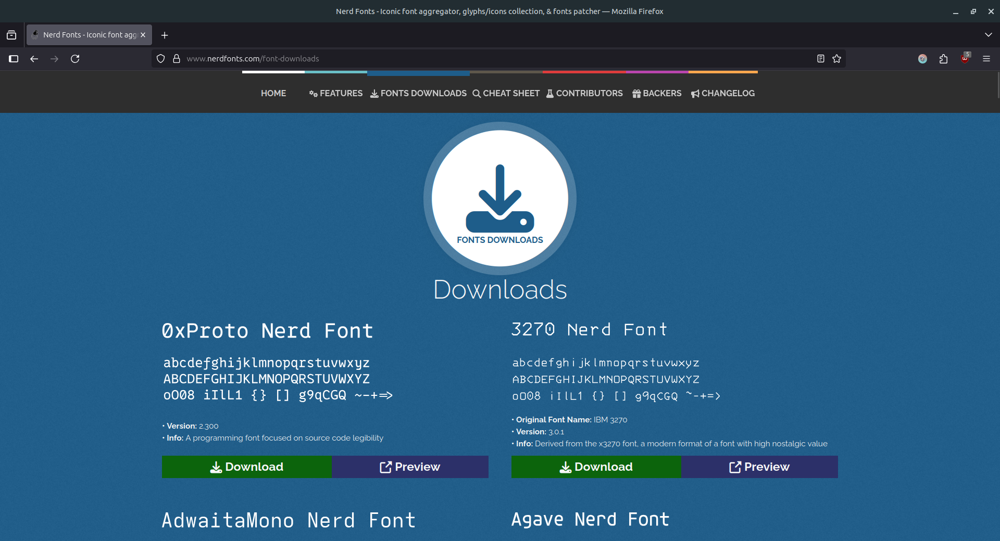
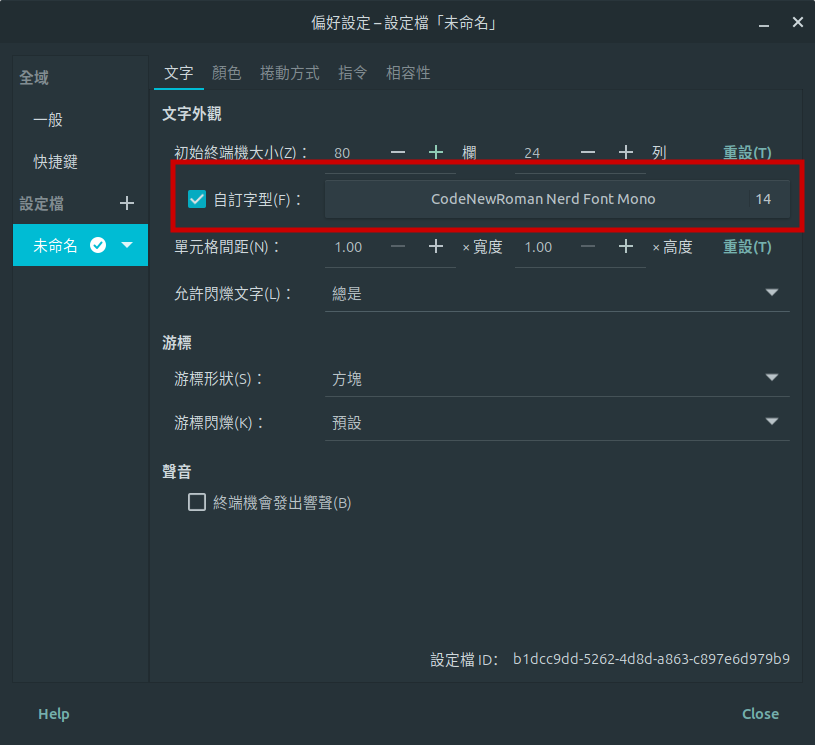
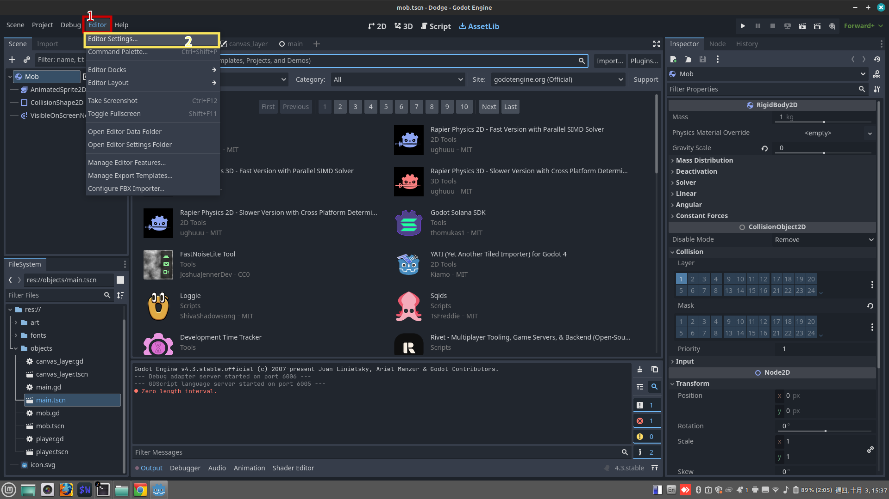
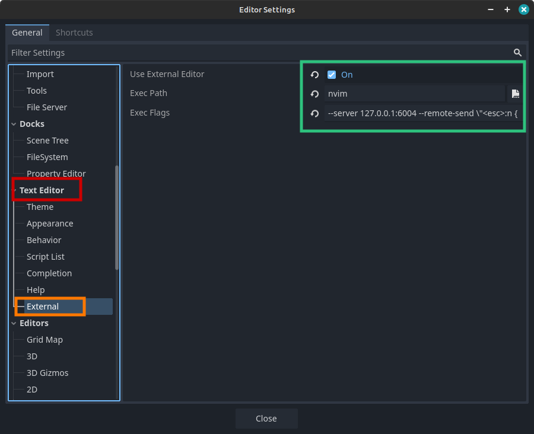

# Install Tutorial

<!--toc:start-->
- [Install Tutorial](#install-tutorial)
  - [For linux](#for-linux)
    - [Install `uv` for python environment](#install-uv-for-python-environment)
    - [Run `install.py`](#run-installpy)
    - [Install nerd fonts](#install-nerd-fonts)
    - [Install ollama](#install-ollama)
      - [Install `nvidia-container-toolkit` to speed up LLM](#install-nvidia-container-toolkit-to-speed-up-llm)
      - [Prepare `docker-compose.yaml` for `open-webui`](#prepare-docker-composeyaml-for-open-webui)
  - [For windows](#for-windows)
    - [Install scoop](#install-scoop)
    - [Install `uv` for python environment](#install-uv-for-python-environment)
    - [Run `install.py`](#run-installpy)
    - [Install Visual Studio](#install-visual-studio)
  - [Setup godot](#setup-godot)
<!--toc:end-->


This document can show how to use this repo to setup for neovim.

## For linux
You should run these commands to install necessary tools.
```bash
sudo apt-get update
sudo apt-get install -y git build-essential
```

You need install neovim `0.11.0+` first. You can clone [neovim](https://github.com/neovim/neovim), and then build by yourself.

### Install `uv` for python environment
This repo uses `uv` to manage python verisons, the virtual environment and python projects.

Please run this command to install `uv`:
```bash
curl -LsSf https://astral.sh/uv/install.sh | sh
```

And then you should add this line into `~/.bashrc` for automatically completion on bash:
```bash
eval "$(uv generate-shell-completion bash)"
```

Please run this command to install the latest python with `uv`:
```bash
uv python install
```

Of course, you can give a version behind the command `uv python install` to install specific verison python. For example, you can run this command to install `python 3.10`:
```bash
uv python install 3.10
```

### Run `install.py`
This repo offers the python file `install.py`. It can install all necessary packages, and then copy all setting files to suitable location. You just run this command.
```bash
uv run install.py
```

### Install nerd fonts
We should install nerd fonts to show cool symbols. You can select one of font on [this web](https://www.nerdfonts.com/font-downloads).



You need download the compressed file, and then decompress it and copy to the directory `~/.local/share/fonts/`. Here gives the commands to show the steps:
```bash
wget https://github.com/ryanoasis/nerd-fonts/releases/download/v3.4.0/CodeNewRoman.zip
unzip CodeNewRoman.zip -d CodeNewRoman
cd CodeNewRoman
mkdir -p ~/.local/share/fonts
cp *.otf ~/.local/share/fonts/
```

We should run this command to rebuild the font cache:
```bash
fc-cache -fv
```

Now, we succeed to install the nerd fonts. Finally, you need change the font of the terminal to use the added fonts.



### Install ollama
This repo uses the plugin [codecompanion.nvim](https://github.com/olimorris/codecompanion.nvim) to let us use LLM in neovim. Also, this plugin supports [ollama](https://github.com/ollama/ollama), so we need install `ollama` for this plugin.

I prefer to installing [open-webui](https://github.com/open-webui/open-webui) using `docker compose` because `open-webui` offers a friendly web inteface to manage `ollama`. If you want to install `open-webui`, you have to install `docker` and `docker compose`.

#### Install `nvidia-container-toolkit` to speed up LLM
In order to speed up the efficiency of LLM with GPU, you need run these commands to install `nvidia container toolkit`:
```bash
curl -fsSL https://nvidia.github.io/libnvidia-container/gpgkey | sudo gpg --dearmor -o /usr/share/keyrings/nvidia-container-toolkit-keyring.gpg \
  && curl -s -L https://nvidia.github.io/libnvidia-container/stable/deb/nvidia-container-toolkit.list | \
    sed 's#deb https://#deb [signed-by=/usr/share/keyrings/nvidia-container-toolkit-keyring.gpg] https://#g' | \
    sudo tee /etc/apt/sources.list.d/nvidia-container-toolkit.list

sudo apt-get update && sudo apt-get install nvidia-container-toolkit
```

Please use these commands to set docker to use nvidia GPU:
```bash
sudo nvidia-ctk runtime configure --runtime=docker
sudo systemctl restart docker
```

You can run this command to test if docker uses nvidia GPU or not:
```bash
sudo docker run --rm --runtime=nvidia --gpus all ubuntu nvidia-smi
```

If you get the error message `ERRO[0000] unable to load config for runtime docker: EOF`, you can add the code into `/etc/docker/daemon.json` to fix this error:
```json
{
    "runtimes": {
        "nvidia": {
            "path": "nvidia-container-runtime",
            "runtimeArgs": []
        }
    }
}
```

#### Prepare `docker-compose.yaml` for `open-webui`
You need prepare `docker-compose.yaml` and `.env`. You can get these files from [this web](https://github.com/open-webui/open-webui).

Here gives an example for `docker-compose.yaml` on the computer with nvidia GPU:
```yaml
services:
  ollama:
    volumes:
      - ollama:/root/.ollama
    container_name: ollama
    pull_policy: always
    tty: true
    restart: unless-stopped
    image: ollama/ollama:${OLLAMA_DOCKER_TAG-latest}
    ports:
      - ${OLLAMA_WEBAPI_PORT-11434}:11434
    deploy:
      resources:
        reservations:
          devices:
            - driver: ${OLLAMA_GPU_DRIVER-nvidia}
              count: ${OLLAMA_GPU_COUNT-1}
              capabilities:
                - gpu
  open-webui:
    build:
      context: .
      args:
        OLLAMA_BASE_URL: '/ollama'
      dockerfile: Dockerfile
    image: ghcr.io/open-webui/open-webui:${WEBUI_DOCKER_TAG-main}
    container_name: open-webui
    volumes:
      - open-webui:/app/backend/data
    depends_on:
      - ollama
    ports:
      - 3000:8080
    environment:
      - 'OLLAMA_BASE_URL=http://ollama:11434'
      - 'WEBUI_SECRET_KEY='
    extra_hosts:
      - host.docker.internal:host-gateway
    restart: unless-stopped

volumes:
  ollama: {}
  open-webui: {}
```

Here gives an example for `.env`:
```ini
# Ollama URL for the backend to connect
# The path '/ollama' will be redirected to the specified backend URL
OLLAMA_BASE_URL='http://localhost:11434'

OPENAI_API_BASE_URL=''
OPENAI_API_KEY=''

# AUTOMATIC1111_BASE_URL="http://localhost:7860"

# For production, you should only need one host as
# fastapi serves the svelte-kit built frontend and backend from the same host and port.
# To test with CORS locally, you can set something like
# CORS_ALLOW_ORIGIN='http://localhost:5173;http://localhost:8080'
CORS_ALLOW_ORIGIN='*'

# For production you should set this to match the proxy configuration (127.0.0.1)
FORWARDED_ALLOW_IPS='*'

# DO NOT TRACK
SCARF_NO_ANALYTICS=true
DO_NOT_TRACK=true
ANONYMIZED_TELEMETRY=false
```

Now, you have `docker-compose.yaml` and `.env`. You need create a directory to store the two files like `~/open-webui/`, and then you should use this command to run `open-webui`:
```bash
docker compose up -d
```

Finally, you need run web browser to open `open-webui` to download LLM.

## For windows
### Install scoop
`scoop` is a package manager for windows. We need use `scoop` to install all necessary packages for neovim.

First, please install `powershell 5.1+`, and then use these commands on powershell to install `scoop`.
```bash
Set-ExecutionPolicy -ExecutionPolicy RemoteSigned -Scope CurrentUser
iwr -useb get.scoop.sh | iex
```

`scoop` need use `git` to manage `bucket` that can collect all newest apps and packages for windows. If you haven't install `git` yet, you can use this command to install `git`:
```bash
scoop install git
```

### Install `uv` for python environment
Please use the commands on `pwsh` to install `uv` via `scoop`:
```bash
scoop bucket add main
scoop install main/uv
```

And then you need run this command to install the latest python:
```bash
uv python install
```

Finally, please use this command to set the environment variable `PATH` for `uv`:
```bash
uv tool update-shell
```

### Run `install.py`
Please run this command to use the python file `install.py` to set the configuration for neovim.
```bash
python install.py
```

### Install Visual Studio
In order to find standard library for `clangd`, we need install `Visual Studio`. You can download the installer from [this web](https://visualstudio.microsoft.com/zh-hant/vs/).

## Setup godot
Please download [godot 4.x](https://godotengine.org/). And then we need run `godot` to change some setting in order to use neovim to write `gdscript`.

Please click `Editor`, and then click `Editor settings...` like this image.



The dialog `Editor Settings` will show on the screen. You need click the tag `External` of `Text Editor`. And then you need follow these steups:
* Enable the check box `Use External Editor`.
* Set the value of `ExecPath`: `nvim`
* Set the value of `Exec Flags`: `--server 127.0.0.1:6004 --remote-send \"<esc>:n {file}<CR>:call cursor({line},{col})<CR>\"`



Now, you can write `gdscript` on neovim. Note, you need execute `godot` before running neovim. Otherwise, neovim LSP cannot work.
